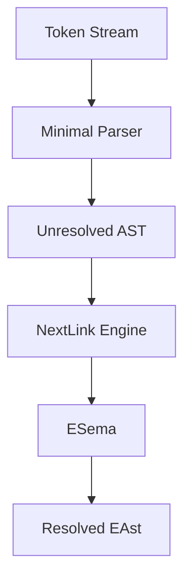
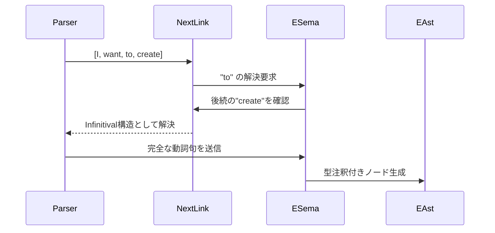

# EIGoScript 言語処理体系設計書

## 1. パーサー設計概要

### 1.1 主要コンポーネント
- **Minimal Parser**: 未解決ASTを構築
- **NextLink Engine**: トークンの文脈依存解析
- **ESema**: 意味解析とAST解決
- **EAst Generator**: 最終AST生成



## 2. NextLink メカニズム

### 2.1 主要機能
```zig
pub const NextLink = struct {
    current: Token,
    lookahead: []const Token,
    context: ParsingContext,

    pub fn resolveInfinitive(self: *NextLink) !EAstNode {
        if (self.current.kind == .To and self.lookahead[0].lexical_flag.has(.Verb)) {
            return .{
                .kind = .Infinitive,
                .children = &.{try parseVerbPhrase(self.lookahead[0..2])}
            };
        }
        // ...他の解釈
    }
};
```

### 2.2 処理フロー
1. 現在のトークンの品詞フラグを解析
2. 先読みトークン（1-3トークン）を検査
3. 文脈に応じた構文パターンを選択
4. 解決済みノードを生成

## 3. EAst 生成プロセス

### 3.1 処理段階
1. **基本構文解析**
   - SVO/SVC文型の識別
   - 句構造のネスト判定

2. **文脈解決**
   ```zig
   // 例: "to" の解決
   fn resolveTo(node: UnresolvedNode) EAstNode {
       return switch (nextToken().kind) {
           .Verb => .{.infinitival = node},
           .Noun => .{.prepositional = node},
           else => error("Invalid 'to' usage"),
       };
   }
   ```

3. **型推論**
   - 動詞の引数パターンに基づく型解決
   - 代名詞の参照解決

### 3.2 EAst ノード構造
```zig
pub const EAstNode = union(enum) {
    function_def: struct {
        name: []const u8,
        params: []Param,
        return_type: TypeExpr,
        body: []EAstNode,
    },
    verb_phrase: struct {
        verb: Token,
        objects: []EAstNode,
        modifiers: []EAstNode,
    },
    infinitival: *EAstNode,
    prepositional: struct {
        prep: Token,
        object: *EAstNode,
    },
    // ...その他のノードタイプ
};
```

## 4. 主要処理の相互作用

### 4.1 解析例："I want to create"


### 4.2 エラーハンドリング戦略
1. 複数解釈可能な場合の候補保持
2. 文脈情報を用いた確率的重み付け
3. エラー回復のためのパターンリセット機構

## 5. 教育支援機能

### 5.1 可視化システム
```zig
pub fn visualizeAst(ast: EAstNode) void {
    // ASTをグラフィカルに表示
    // 品詞色分け、構文関係の可視化
}
```

### 5.2 エラーメッセージ例
```
Line 5: 'to' の使い方が不明確です
可能性1: 動詞を作る不定詞 (to + 動詞原形)
可能性2: 前置詞句の開始 (to + 名詞)
文脈ヒント: 直後に続く 'create' は動詞です
```

## 6. テスト戦略

### 6.1 テストケース例
```eigoscript
# ケース1: 基本不定詞
I want to create a function.

# ケース2: 前置詞としてのto
Send data to server.

# ケース3: 複合構造
Try to quickly start to learn.
```

### 6.2 テスト指標
| 項目 | 目標値 |
|------|--------|
| 構文パターン網羅率 | 98%以上 |
| エラー検出率 | 95%以上 |
| 曖昧性解決成功率 | 90%以上 |
| 処理速度 | 10KLOC/秒 |

## 7. 今後の拡張

### 7.1 短期目標
- 動詞パターン辞書の拡充
- 型推論アルゴリズムの最適化

### 7.2 長期目標
- 機械学習による文脈解析
- リアルタイムコード提案機能
- マルチモーダル入力対応

この設計は、自然言語処理と伝統的なコンパイラ技術を融合させ、教育的配慮を組み込んだ独自のアプローチとなっています。NextLink メカニズムは文脈依存解析の核となる重要なコンポーネントで、英語の自然な構文構造を効果的に捉えることが可能です。
